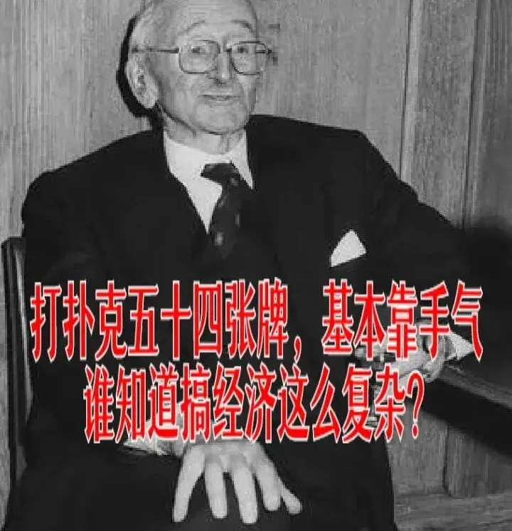
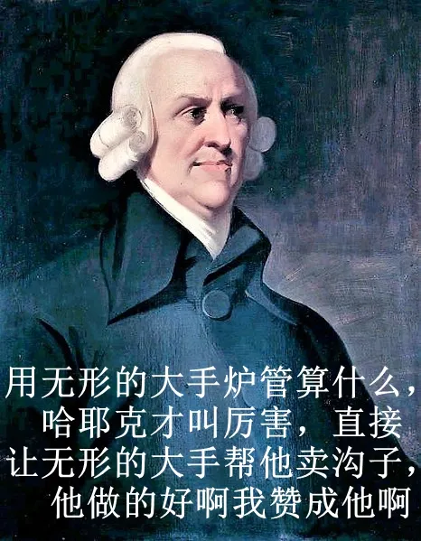

# 哈耶克真正的身份，就是男妓，他在昂撒卖过沟子，我祖宗传下来的....

~~~~ yml
auth: 真知子
publ: 封酒
time: 2024-03-26 17:47
regn: 华北
~~~~

为了引起大家的同情心，各位有所不知，这段经历早就美化过了...**哈耶克真正的身份，就是男妓，他在昂撒卖过沟子，我祖宗传下来的....**哈耶克一辈子搞自由市场，其实就是卖沟子，**走一回一个自由市场太伟大了**。我祖上是昂撒人，地地道道的工人，日过哈耶克。

很多人不敢相信哈耶克以前当过兔爷，但是你想想，他一个日耳曼人，当时昂撒还在和德国打仗，他凭什么能够留在昂撒？在那种世界大战乱世中，粮食比金子还珍贵，啊，就凭他说自己是自由市场坚定支持者，政府就得给他吃的？**按照市场规律他必然要付出点什么吧，你说是吧？** 这世间的无本生意，可不就是卖腚眼子吗？

1. 哈耶克此人**自由意识极为精湛，对市场规律把握特别深刻**，就是在这段时间养成的。如果大家跟性工作者打过交道，你就会发现，他们的自由交易躲避政府追查的意识比绝大多数人都要强，但同样的，他们对于人性的悲观也要远远强过绝大多数人。 
2. 哈耶克来到英国没多久就在伦敦政治经济学院任教，人气在整个昂撒世界还很高。从侧面也能知道哈耶克此人还是深谙自由交易之道的，不然的话，**为什么大家都愿意照顾他生意呢**，你说是吧？
3. 哈耶克为啥得德国英国美国各个大学到处跑啊？因为这事大家都是尝个鲜，没啥回头客。所以他要不断的获取新流量，而且的话，如果只在一个大学卖，**大学里观念开放，玩法会越来越变态**，他也受不了。 
4. 哈耶克的狂热堪称自由市场的选择。稍微正常一点的人都没办法理解哈耶克怎么能够支持自由市场到这种程度，你说他出身上流，所以支持，这扯淡。**我跟贵族打过交道，绝大多数贵族除非你要抄没家产挂他们路灯，否则很多情况下他们是非常体面的。只有被自由市场创似的人才会睚眦必报。** 你想一想，我祖宗二三十个昂撒工人撞他的时候，为了开心，必然会说出大量的粗鄙之语， you motherfuckers，you fucking pussies ，哈耶克也只能嗯嗯啊啊地**说自由市场好，你说得对我赞成你啊，你干去你干去，你是消费者你有自由选择的权利嘛**。长此以往，内心必然扭曲。
5. 厌恶政府干预。哈耶克总喜欢吹嘘自己不喜欢政府干预只喜欢自由市场，**实际上是因为做鸭生涯实在过于恶心，政府也没有出手帮他，让他对政府产生了厌恶**，这种厌恶甚至蔓延到了自己的学术观点上。
6. 趋炎附会。这个更不用说了，**自打有自由市场以来没有见过比此人更下贱的**。政府作为看得见得手，操纵市场，压制自由，岂敢对它示好？哈耶克个比亚迪，屁颠屁颠地接受了英国女王颁发的荣誉，跟她谈了一会后就说“一生中最快乐的一天”“对我是如此的平易近人而又亲切，有如她对我一生了若指掌一般。”只要是认同他的，他就疯狂的舔。只要是反对他的，他就极尽攻击之事。他得势的时候，**叫嚣道“社会主义者越攻击我越说明我做对了”**。他老师米塞斯在奥地利政府当经济顾问的时候也没说“太伟大了陶尔斐斯”，“没有政府我什么都不是”吧，相反，**米塞斯先生越任职，越辞职，从奥地利到瑞士再到美国，宁可接受商人资助也不向政府乞讨，桃李满天下**。他这种毫无自尊，极度下贱的人格，就是被尻出来的。**试想一下，一个正常的自由主义者会干这种既没骨气又无自由的事情吗？**正常自由主义者，既难以接受看得见的大手的嘉奖，也不会乞求大手的施舍。他这几年，已经把他的人格彻底摧毁了。 
7. 他的自由市场理论，相比以往经济学说，都极为偏向看不见的手。这个我后面细说。总之你会发现，在哈耶克的这个理论内，**你唯一值得信任的就是看不见的手**，政府必须严管，消费者和劳动者绝对不能反抗剥削，大生产者规模再大也不能叫垄断。他去搞哲学社会学，写出一本《通往奴役之路》，**搞的经济学界和哲学社会学界都不认他**，但毕竟要当导师可以理解。可是他看不见的大手摆到高高的位置，连垄断都不承认，这事为何？这是因为，**他卖沟子的权利都是大手给他的，没有看不见的大手他什么都不是，不是大手点将给他卖沟子的机会他还在南德的山沟沟里给奥匈打仗呢**。不是说打仗不好，经济学界更加海阔天空嘛。不管哈耶克如何隐藏，他骨子里的那种男妓的卑贱还是弥漫影响了整个当时的经济学界。 
8. 哈耶克油光满面气质不凡，证明在昂撒深造任教期间过的不错...试想一下，在那个大战的年代，老百姓饭都吃不饱，**他一个上昂撒要饭去的日耳曼人的凭什么精气神那么好，吃得营养那么高？** 只有一种可能，就是他确实是在自食其力，至于怎么自食其力，诶，我就不好多说了，免得某些人心碎。

