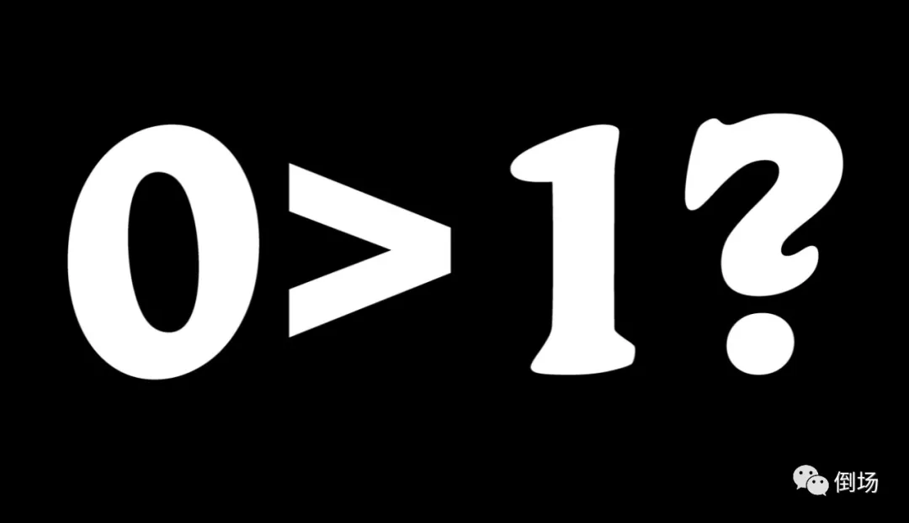

# 为什么人一定要走真理之路？

[原创 三叔 倒场 2022-05-13 15:42 湖南](https://mp.weixin.qq.com/s/Hw_ID2XRhu2908KCRx1s7Q)

巴门尼德借梦中女神之口——也可能是女神借做梦的巴门尼德之口，指明了去往真理的道路： **存在者存在，不存在者不存在。** 然而，虽然女神的路引插在人间的土地已近二千六百年，但走上这条真理之路的人却依然寥寥无几。兴许是对于世人来说，女神的指引就跟那个迷路的孩子给出的回答一般无用（人们问孩子：“你住哪里？”孩子认真的答道：“我住在家里！”），以至于往往被一笑置之，说不得还要调侃几句哲学与哲学家们的傻气。

的确，倘若聪慧的我们认为自己已经明了这句绝对正确的废话到底在说什么，那么不论是真理之路，还是与之相对的谬误之路自然是同样的可笑：“**存在者不存在，不存在者存在**”。也真是辛苦女神大人专程到巴门尼德的梦中走这一趟——除了疯子和傻瓜，谁会认为存在者不存在，而不存在者存在呢？

但问题在于，在如今这个据说已经由科学和理性思维主导的现代世界，似乎仍有至少一半以上的人坚信，如果离开了某种伟大且崇高的力量之庇护，人类以及人类文明是不可能存在也无法延续的（当然，人们对于这种力量的称呼足足有一千亿个，请原谅我无法一一列举）。而剩下的那一半虽然对这种带有神秘主义倾向的说法嗤之以鼻，但其中的绝大多数也都理所当然的相信，作为存在者的芸芸众生必须在一种至少听上去更加科学合理的场域的担保之下，才能维持其存在（因此，关于后一种力量的称呼就显得“现代”很多，比如国家、市场、社会乃至时空）。

换言之，不论是前者还是后者，似乎都遗忘了一个基本的事实：不论是哪一种被当做存在者存在之前提的力量，归根结底都只不过是存在者之存在在另一个存在者身上的投影或显现，或者说得更直白些，都无非是作为存在者的人的衍生物。但是，莫名其妙的，人和人之衍生物的关系却在人这里颠倒了过来：原本的衍生物堂而皇之的坐在了人的头上，摇身一变成了人的前提，并对人展开各种限制和规定。仿佛人首先得依赖于其衍生物才能存在，甚至得为了确保其衍生物的存在而放弃其自身的存在状态。（马克思已经说得很明白：在一个以产品/商品为主导的世界中，人越是劳动，就越是生产出一种异己的力量，这种力量反过来统治和支配人。）

我知道有人立马就能掏出一种“辩证”的说法来反驳，他们会信誓旦旦的宣称，人和世界之间的关系是相互的，只有当一个人首先进入一个“预先存在”的世界/场域之中，才能发挥其“主观能动性”，对世界/场域展开改造的行动（且不提“改造”这个词是否硌人）。我无意否认这种相互关系，但即便这种关系真的存在，这一说法本身也依然是人的产物，因此在逻辑上，作为存在者的人依然是这种关系的前提（或许同时也是结果），但我们决不能绝不能说人的衍生物，或者说存在者的衍生物是存在者存在的前提。

最初写圣经的那人从来没有读过圣经，写出《共产主义宣言》的马克思也从来没有接受过“系统的共产主义教育”（如果我们没有搞错马克思生活的年代的话，他生长于尚未完成政治解放的君主制德国），这说明一切看似“先于存在者的存在”丝毫不能支持也无法妨碍一个存在者开启一项从未存在过的事业，开启一个在整个存在者历史中从未存在过的全新的世界——

这意味着，作为存在者的人虽然栖身于世界之中，但世界本身是存在者之存在的结果（康德发来贺电），是存在者之存在本身的绽出和涌现。（哪怕一个从没听说过共产主义为何物的人——比如青年时期的马克思本人，只要ta作为一名存在者存在于其他存在者之中，切身的体会过在他自己与其他存在者身上发生着的悲剧与苦难，ta就已经具备了成为一名共产主义者的可能性）

然而，在这个据说把存在者与其存在之权利摆在首位的现代世界中，绝大多数存在者依然不假思索的接受并践行着那种头脚倒置的观念：存在者需要一个存在者之外的前提才能存在——这不正是真理女神早在两千五百年前就警醒过世人的那条“谬误之路”吗？仿佛那看不见的造物主，那冥冥中操控市场的手，那波谲云诡的命运长河，那宏伟得让每一个存在者显得无比渺小的伟大使命，都是比存在者更为真切的存在，以至于原本可以昂首矗立于天地间的存在者们，如今也只好卑微的匍匐在不存在者们的脚下了。

不存在的**零**牢牢的掌控并压榨着已然存在的**一**，为了让不存在的**零**看上去真的存在，已然存在着的**一**不得不一再出让其存在，这是**一**自存在以来就一直遭遇的境况。但这种境况的出现绝不能简单的归咎于不存在的零，而只能在存在着的一中寻找答案——

试问哪个一没有信仰过或正在信仰着零呢？试问哪个一不曾把一切期待和希望都放置在零的身上呢？在存在的威胁尚未显露之前，我们追求着“零”风险的生活，“零”杂质的爱情，“零”污点的形象以及“零”困惑的“真理”，而如今“零”终于回应了“一”们的召唤，终于近在咫尺，“一”们为何又如此恐慌，甚至对于“零”的到来惊诧得像是遭遇着一场与他们毫不相干的灾难一般呢？

难道不是一们自始至终抱着对零的幻想，才导致原本不存在的零如今存在得比一还要真切吗？难道不是因为存在者们从来都不敢相信仅凭其自身就能存在于存在者的世界，才亲手编织出了各种关于零的谎言，并要求所有的存在者都相信这些谎言吗？

过去的两千六百年间，真理女神好不容易等到的寥寥几位存在者不厌其烦的提醒世人务必郑重的思考关于存在的问题，但我们也不厌其烦的把这个问题当成一个令人捧腹的笑话，或许还不忘讽刺那些正在认真考虑这个问题的“异类”——哪怕这个问题已经逼临到了眼前，也鲜有人愿意花哪怕一秒钟的时间来考虑为什么一些人愿意用一生的时间来追问这样一个“显而易见”的傻问题：

**存在者存在，不存在者不存在？为什么？**

即便每一位存在者都不可避免且不止一次的为这个问题晦暗的威力所掠过；即便在每一个绝望的时刻，每一个万物齐黯，诸神消隐的时刻，甚至是此时此刻，这个问题总在我们面前浮现，在房间外重重拍打着门板，但我们宁可捂上被子，继续做着关于不存在的零大于存在着的一的美梦，也死活不肯看它一眼。

难道不是这样吗？

当我们遭遇痛苦时，当我们的生活濒临崩塌时，当我们面对未知的恐惧时，绝大多数人难道不是幻想着立马得到一个关于“我该怎么办”的“正确答案”吗？我们不是轻而易举的就让渡了自己的存在，把问题一股脑的抛给那些看上去无比宏伟强大的“零”去解决吗？

试问有几人能抛开对于零的幻想，转过头来仔细体会其自身的存在呢？又有几人敢于拒绝零的邀请，拒绝“只要你听我的安排，一切都会好”的承诺，坚信仅凭其自身之存在就能“无中生有”，展开自我认识、教育以及生产的行动，独自承担存在的责任呢？

原来没人走那条真理之路不是因为它可笑，而是因为谬误之路好走太多。

但即使我们吃着火锅唱着歌，捂着耳朵闭上眼，轻松愉快的走在这条由零铺就的康庄大道上——它自然是“零风险”、“零杂质”、“零污染”也“零困惑”的，但这绝不意味着存在会停止向我们发出的它的诘问。

因为

**如果不存在者存在，那么存在者就不存在！**

**只有存在者自己站出来存在，不存在者才能不存在！**

--------------------------------------------

倒场：一麻袋公共空间，对话、行动和产出的现场。
