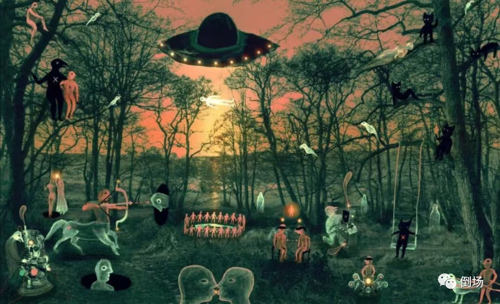

# 把“精神”当成“理智”将毁灭世界

[原创 海德格尔 倒场 2022-08-18 12:04 湖南](https://mp.weixin.qq.com/s/VhQgyZskZgOJFx-9O-2EUw)

当我们说世界的没落时，世界指的是什么？世界总是精神性的世界 *（那种把世界理解为“与精神无关的众多客观物质之集合”的幼稚的唯物质论调虽然在内容层面否定了世界的精神性，但这种论调本身仍是精神性的）* 。动物没有世界，也没有周围世界的环境。因此，世界的没落就是精神的没落，就是对精神的力量的一种**剥夺**，就是精神的消散、衰竭，就是排除和误解精神。现在我们要从某一个方面，而且是从对精神的误解这一方面来说明精神力量是如何被剥夺的。

……（*这种剥夺导致*）所有的事物都陷落在同一个层次上，陷在表层，这表层就像一面无光泽的镜子，它不再能够反射和反抛光线。（*在精神中*）占统治地位的维度变成了延伸和数量的维度（*仿佛成长就是“变大”和“变多”*）。“能力”一词不再指涉那种从高尚的充盈处流溢着的力量，或某种汹涌澎湃呼之欲出的潜能，而是仅仅指那些任何人都可以“习得”的，总是与一定的血汗和消耗相关的一点“技能”。

……这种剥夺源于对精神的误解；这是我们**至今**还身处其中的一种历事。这种对精神的误解从四个方面简述如下：

第一：**将精神曲解为智能，这是决定性的误解**。这种智能就是单纯的理智，它思考、计算和观察那事先给出的事物、它们可能出现的演变以及那随后出现的新事物。这种理智是单纯的才能，是可以训练和批量分配的。这种理智自身驯服于组织化的可能性之下，而它整个的是跟精神格格不入的。所有的文学风格和美学意趣都只不过是被曲解为智能的精神的后来产物和变种。**纯粹的才智是精神的假象并且掩盖了精神的匮乏。**

第二，如此被曲解为智能的精神因而就沦为替其他事情服务的工具的角色，成为既可以教授也可以学到的东西。无论这种智能的功用究竟是涉及到物质生产关系的调整和控制（在马克思主义那里），还是一般的满足一切随时当前且已被设定的东西的理智的安排和解释（在实证主义那里），抑或这种智能是在一个民族的精神群体的组织操纵中起作用（在民族主义那里），无论在上述哪一种情形下，精神作为智能都变成了与其他事物——因为它们无精神甚至反精神，所以是真正的现实事物——相对立的上层建筑。

如果人们将精神理解为智能，就像马克思主义以极端形式所做的那样，那么为了免遭攻击，就完全应当说，精神，亦即智能，在人类此在的诸多活力的位序上，总是不得不排在健康的肉体能力与特性之后。但是，一旦人们在其真理性中把握了精神的本质，这一位序就变得不真实了，因为肉体的所有力量与美，战争之稳当与冒险，还有理智之老实与机灵，都植根于精神之中，它们只有在当下精神的有力或无能中，获得提升或陷入崩溃。精神是承载者和统治者，是第一的和最后的，而非任何其他。

第三，一旦这种对精神的工具性曲解开始运作，那么，精神历事的力量，诗歌与创造性艺术，国家的创立以及宗教活动，都进入一种可能被有意识的培植和规划的范围内。上述这些同时被划分为许多领域。如此一来，精神的世界就变成了文化（的世界），而个体的人就乞求在这种文化的创造和保持中达到自身的完成。这些领域就变成了自由作为的区域，这种自由作为按照它自身恰好已经达成的意图来设置标准（*仿佛文化的制作和使用就代表了精神的充盈，就完成了自身的实现*）。这种适用于制作与使用（文化）的标准被称为（文化/精神）价值。文化价值要在一种文化的整体中保证其意义，就必须通过它将自身限定在其自我的有效性上：为诗歌而诗歌，为艺术而艺术，为科学而科学。

在大学里和我们尤为相关的科学身上，可以看到近几十年来虽然经历过一些洗礼却一如既往的状况。虽然现在好像有两种看上去不同的对科学的态度在相互争斗，一种态度认为科学是技术的、实用的职业性知识，另一种认为科学本身就已经是文化/精神价值，但是，这两种看法都浮动在相同的沉沦道路上去曲解并亏损精神。它们之间的区别只是在于，关于科学是技术的、实用的专业知识的看法在当今的情况下至少还可以主张一种清晰明了的逻辑一贯性；而那目前重又兴起的把科学解释为文化价值的看法则企图通过一种无意识的谎言来掩盖精神的衰败。

这种精神丧失的迷乱甚至可能走得如此之远，以至于将科学当做技术、实用的解释同样也承认了科学本身的文化价值，这样，这两种看法就在同样的丧失精神的症状中达成了同盟。如果人们为了教学和研究而把诸多专业学科综合在一起的设施称为大学，那么这只是一个名称而已，绝没有什么原始协调一致、情理逼人的精神力量可言。一九二九年，我在这所大学的就职演讲辞中说过的话，对于今天的德国得学也还适用……“科学的诸领域相距遥远，它们对其对象的处理方式也根本不同。这种不同学科散乱的多样性，今天只有通过各大学和学院的技术组织才能聚拢在一起并且通过各专业的实用目标获得意义。但是，这样一来，科学的扎根活动在其根基处就已经死亡了。”今天，科学在它的所有领域内都成了一种获取知识与传授知识的技术性事物。**从这样的科学出发根本不可能发生精神的唤醒，倒是科学自身需要这样一种唤醒**。

第四，对精神的最后一种曲解植基于前面所说的一些篡改中。这些篡改把精神想象为智能，把智能想象为为目的而设的工具，再把工具和产出的产品一起想象为文化的领域。作为为目的而设的、沦为智能的精神与作为文化的精神最终就变成了人们摆在许多其它东西旁边用来装饰的奢侈品与摆设。通过公开展示这些装饰物，人们宣称他们并不想否弃文化，并不想成为野蛮人 *（但实际上，我们已经沦为理智的野蛮人，或者说野蛮的理智人）* 。比如苏联在经历了最初一段（*对文化的*）纯粹否定性的态度之后就立即过渡到了上述宣传策略中。

与这些对精神的多重扭曲相反，我们现在将精神的本质简略的规定如下：

精神既不是空空如也的机智，也不是无拘无束的诙谐；既不是无穷无尽的知性剖析，更不是什么世界理性。**精神是朝着存在**之本质的原始基调的有所知**的决断**。精神是对存在者整体本身的权能的授予。精神在哪里主宰着，存在者就在哪里存在得更为深刻。

因此，对存在者整体本身的追问，对存在问题的追问，就是唤醒精神的本质性的基本条件之一，因而也是历史性的此在的原初世界得以成立、防止导致世界沉沦的危险的基本条件之一，因而也是承担处于西方中心的我们这个民族的历史使命的本质性的基本条件之一。我们只有在这些放大了的笔触中才能摸清楚，对存在问题的追问本身确实在多大程度上逐渐成为历史性的；摸清楚这一问题对我们来说究竟是一团纯粹的迷雾还是涉及整个西方的命运，就不再只是一种夸张之辞和无稽之谈了。

---------------------------------------------

*本文摘录于海德格尔《形而上学导论》（熊伟，王庆节译，商务印书馆1996年出版）第一章《形而上学的基本问题》，有修改，括号内斜体部分由编者（三叔）添加。*

