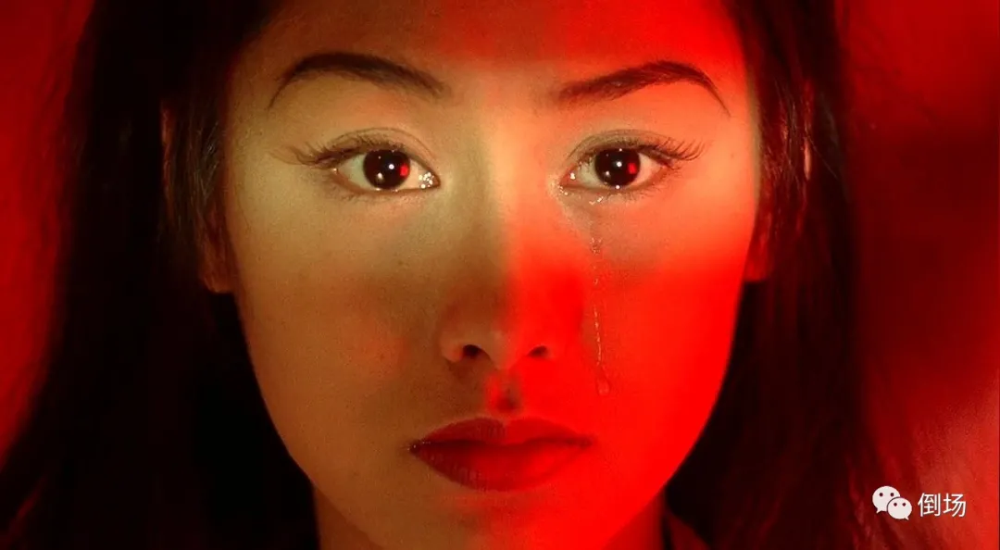

# 为什么一封信总抵达它的目的地——精神分析视角下的《大话西游》

[原创 三叔 倒场 2021-10-31 12:56](https://mp.weixin.qq.com/s/jisQbiP4lipwDN_O2oobnA)

*“命运”总是通过这样偶然的遭遇来表达自身，并提出一个问题：“如果我没听到那句话，如果我采取另一条路线（行动），避免了那个场景，又会怎样？”这些问题当然是欺骗性的，因为“一封信总是抵达它的目的地”：它耐心的等待着它的时刻——如果不是这个，那么，另一个偶然的、细小的现实迟早也会发现它自己就处在这个等待着它的位置上，并引发创伤。——齐泽克《享受你的症状》*

不妨把周星驰的《大话西游》作为“论题电影”（即可以用来证明某一个论题的电影，这个概念源于萨特，与此类似的还有“论题小说”、“论题新闻”等……）来代入，一切就会清晰明了很多。

首先，身为山贼的至尊宝根本不想卷入什么神仙之间的争斗，更不想当什么齐天大圣，他只是狡黠而滑头的经营着自己的的一亩三分地。

但麻烦的事情在于，信使每天都在敲门——他重复的做着同一个梦，梦中他总是来到一个山洞，有个声音告诉他要护送唐三藏取西经，而至尊宝的反应是癔症式的：“大姐，你找错人了，你找的人不是我。”或者用齐泽克的话说，至尊宝遭遇了“意识形态大他者的召唤”：你就是取经人；而至尊宝拒不接受：“正因为我就是它的地址，以至于我根本无法从中认出我自己。（虽然我收到了信，但很明显信不是写给我的）”

但信使们（菩提、白晶晶）接种而至——白在看到刮完胡子的至尊宝后立马就喊出了“臭猴子！”，并在一系列阴差阳错中坚定不移的认为对方“就是”那只猴子（用三昧真火烧他，其实烧的是菩提的手），顺便提到了一笔符号性债务（当年我们订过婚，但你个臭猴子单方面悔婚）；而菩提奉上的照妖镜更是留下了伏笔。

至尊宝当然不愿承担这个符号性的委任（尤其是在看到照妖镜中的自己依然帅气的时刻），他只想继续当他的山贼顺便泡个妞（如果我没听到那句话，如果我采取另一条路线避免了那个场景，又会如何？仿佛只要留在原地，只要不“主动”去承担什么“取经人”的责任，就可以再安安心心继续过悠哉的日子），但白晶晶的中毒打破了至尊宝的鸵鸟行为，为了让心爱的女人活下去，至尊宝“只能”破例当一回英雄。

于是，一个原本不是英雄的男人“被逼无奈”走上了成为英雄的道路，而白晶晶的死亡导致至尊宝不得不开启月光宝盒，把自己作为一封信寄到500年前的水帘洞，寄到那个将要给他三颗痣的女人紫霞手上（直到此刻，至尊宝才从照妖镜中“看见”自己的符号性身份——一只戴着金箍的猴子，需要注意的是，这里不是想象性认同，而是符号性认同）。

但此时的至尊宝依然不是齐天大圣，唯有当他真的想要“是”齐天大圣时，他才能“成为”齐天大圣——于是，在此后的情节中我们几乎看到了一个可以说是重复的结构，至尊宝仍想继续当鸵鸟（躲在山洞里安心跟白晶晶成婚），但紫霞被牛魔王俘虏即将成亲，而唐僧将在婚礼当天被吃掉，这逼得至尊宝为了还债（当然你也可以说是为了爱情，虽然指向的不是同一个女人）只能再当一次英雄——终于，他“在信里头认出了他自己”：不论他是不是齐天大圣，他都必须得“成为”齐天大圣，否则那个爱他的女人（紫霞）和符号性债务的主人（唐僧，我们应当很容易记起，这位话痨曾经对观音说用自己的命换猴子的命，于是至尊宝莫名其妙的欠下了一笔债务，这不正是“父子”间最为常见的结构吗？）就要遭殃。

然而，这个故事真正带给我们的“精神分析”式的经验绝不是说，命运必定会让一个人成为他自己（比如至尊宝的“本质”是齐天大圣，所以意识形态的大他者才会召唤他，然后他必然会成为齐天大圣），不是这样的，这恰恰是齐泽克所说的“幻觉”或者“误认”，这里的逻辑恰恰需要倒转过来：一个人在成为他自己的那一刻，他才回溯性的认识到自己的命运——“无论是谁，只要他发现自己处于这样的位置，他就成了地址……”。但这种“任意性”在结局到来的时刻，又成为了“必然的”（虽然这种必然性其实是一种幻觉，但这种幻觉为发生的一切回溯的锚定了意义）。

另一方面，这个故事也并不能想当然的解读为“男人为了心爱的女人于是成为了大英雄”，我们不应该忘记的是，首先“爱情”和“英雄”在至尊宝这里完全是冲突的——一旦他想要得到爱情，他就不得不成为英雄，可一旦他成为了英雄，他就必须放弃爱情（在最后的决战中，他跟紫霞的对白清楚的呈现了这一点），正如齐泽克所言“男人是分裂的，他分裂为懦弱的、可以发生性关系的日常人物（至尊宝），和符号委任的承担者（齐天大圣）……我们就这样被迫去选择：只要我们强迫伴侣揭示/承担起符号身份，我们就注定要失去他——对于紫霞而言，一旦她希望至尊宝化身为脚踏七彩祥云的齐天大圣，她就注定要失去他。

最后，我们还可以说，至尊宝作为一封在众人手中流转的信件，玷污了每一个人（每个人都认为得到他就能获得幸福，但每个得到他的人都遭遇了厄运）——山贼们信任至尊宝，未曾想跟着老板混，三天饿九顿，一个个非死即伤；白晶晶爱上他，但500年前被悔婚，500年后发现这个男人爱的从来都不是自己；而他的“真爱”紫霞，则“真的”为他而死。

这些人的悲剧最终只是为了达成一个目的——让至尊宝成为齐天大圣，换言之，当他成为那个人时，故事就可以结束了（因此上下集加起来有四个钟头，但“齐天大圣”只需要出现十分钟——在这十分钟里，他偿还了一些债务，但又欠下起一些新的）。在这里我们不难发现《大话西游》跟卓别林《城市之光》相似又相异的部分——无独有偶，身为“污点”的男主（至尊宝是山贼，卓别林是流浪汉）都被女人误解为一个理想的形象（齐天大圣、百万富翁），但差别在于，在《城市之光》里，当卓别林的符号身份被剥离，以所谓的“真实面目”出现在女人面前时，信就抵达了目的地；而在《大话西游》里恰恰反过来，当至尊宝终于开始回应大他者的召唤，终于承担起他的符号性身份（齐天大圣）时，信也同样抵达了目的地。

但在我看来，周星驰比卓别林更为“自恋”（或者说，更加渴望成为“阳具”，即便他成为阳具的道路足够迂回），卓别林给出的开放性结局给我们留出了一个拉康意义上“并非全部”的女性空间（不论流浪汉还是卖花女，都从对方的幻想空间中掉落出来，他们在此刻都是“女人”）；而在至尊宝这里，是两个女人的悲剧才成就了他“蜕变”一刻的高潮——周星驰的聪明之处在于，他为猴子这个形象涂抹了足够多的悲情色彩，并在最后一幕夕阳城楼场景中给予那个跟紫霞长得一模一样的姑娘“象征性债务的补偿”（心爱之人的吻），但这种悲情和补偿在本质上是虚伪的，这种虚伪在诺兰的《记忆碎片》中呈现得更为清楚。

电影制造的就是这样一种幻觉，至尊宝的逻辑是“为了救紫霞，我必须成为齐天大圣。”但事实上，即便他成为了齐天大圣，到头来他也没救紫霞（反而是紫霞为了救他而死）。我们在这里不能简单的把紫霞死掉这个锅甩在牛魔王身上，牛魔王并不想杀死紫霞，真正让紫霞陷入危机的是至尊宝（男人总是以一种自以为成熟但其实幼稚的方式来处理跟女人的关系：猴子一个筋斗降落在紫霞身边，然后残忍的告诉她，自己不是至尊宝，而当紫霞以死相逼时，猴子的原话是“要死就死远点！”）

我们可以在很多故事里看到类似的情境，当一个人男人觉得自己不能给女人幸福时，他粗暴的告诉女人，自己已经对她没有感情，然后代替对方做出决定（不论你接不接受，反正我们结束了！）然后在心里偷偷的告诉自己，我这是为她好，她应该去找一个能给她幸福的人……（就像猴子对紫霞说的，愿你找一个如意郎君）云云。看上去，男人的牺牲成全了女人的幸福，但实际上恰恰相反，男人的牺牲真正成全的是他自己的自恋——他真正恐惧的不是女人得不到幸福，而是女人将来有一天发现，不论他成为或拥有什么，自己都会让女人失望——就跟至尊宝一样，即便他驾着七色云彩华丽登场，手里握着那根世间最硬的铁棒，也依然改变不了让紫霞失望的命运（我们甚至可以说，在爱情中，万众瞩目的“齐天大圣”其实是比猥琐滑头的“至尊宝”更为无能的存在）。

-------------------------------------------
