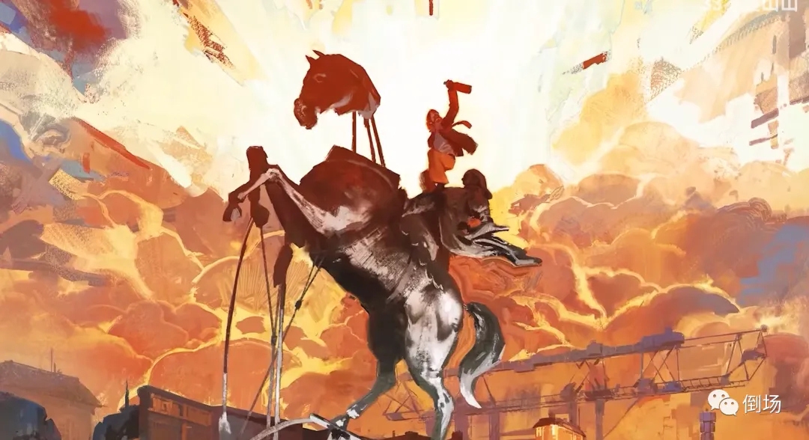

# 为什么艺术一定不能是“必须”的东西？

*[原创 三叔 倒场 2023-04-30 16:35 湖南](https://mp.weixin.qq.com/s/hLZvHbKwoW-DU95CHL6DQA)*

吃饭是必须的，挣钱是必须的，身体和生命也是必须的——如果一个人还想活下去。而疯子和艺术家之间的共通点在于，她们有可能将人们视作“必须”的东西置于一种危险的境地，至于生活是否继续以及意义是否到来，并不是“那一时刻”需要考虑的问题。

一切创造行为本身就具有即时性，并不存在“一个艺术家创造了一件艺术品”这样的事情发生，而是说，某个“必须品”在某个时刻被交出，却没有任何人知道究竟能换/唤回什么。同时，经历（而非完成）此行动的人可能需要花上一些时间才能明白这是一个“创造”——不仅仅是作品被创造，同时艺术家也被这一创造行为本身创造出来。因此，艺术家是一个“即时”的身份，这个身份是断裂的，而非持续的——她甚至不需要花时间去理解自己，而只需要“生成”，理解是哲学或精神分析的工作。

现实是一个由“必须性”原则编织起来的网络，在某种程度上，它是意识的；然而一切有资格称之为“文明”的东西都无非是必须之外的“过剩”，进食是必须的，但进食不足以构成一种文明——除非有某种“过剩”参与其中，比如把食物制作成某种特殊的形态，即便这一过程中耗费了更多的精力并损失了部分食物，但更“特别”了——“特别”这个非必须的过剩的体验才能算做文明。艺术同样如此，它是意义不明的、不连续的过剩，因此它是无意识的——无意识恰恰是那个“不该”出现在意识之中的多余的东西。

如同哲学和艺术曾经都不过是服务于宗教这个“必须之物”的“婢女”，倘若我们致力于把艺术以及艺术家证明为一种必须的，或者能服务于某种必须性的东西——比如能“获得快感”或“提升审美”（重要的问题是，快感和审美对人而言是“必须”的吗？）无非是让这个婢女再次改嫁而已，不论这场婚礼再怎么皆大欢喜，新娘总该是有权利说不的。艺术无需被由必须性统摄的现实所收编，就像无意识无需也不可能被意识收编一样，任何实现这种收编的意图都掉进了拉康男性公式的陷阱里——一切都服务于必须性原则，除了必须性原则本身（所有人都遭遇了阉割，除了实施阉割的那个人）。

人们没有兴趣谈论艺术，并不是因为艺术不是必须的东西，更不是因为当代艺术涉及过多晦涩的哲学概念而令人感到不可理喻——概念的泛滥绝不是概念本身的问题；而是因为已经很难有作品能直接而强烈的击中人们的无意识，以至于不得不用各种各样的概念来论证“这个”或“那个”作品的必须性或者有效性。说到底，人们对艺术失去兴趣，是因为艺术放弃了它存在的家和战斗的阵地，那个断裂的、过剩的、无需任何既定现实意义作为依据的场域，即无意识的场域。这使得艺术品沦为一些或精致或不精致的“小玩意儿”。同时，艺术不光在“外部”没有讨论性，在艺术家这个群体内部同样不可谈论——所有的讨论都将终结于“艺术没有好坏标准”，就像“每个人的每个想法都值得尊重”一样政治正确又无聊至极。

当艺术家成为一种职业，成为现实网络中一个必不可少的环节，那么艺术的确就已经没有什么可谈论的了。艺术中被巴塔耶称之为“至尊性”东西，被拉康称之为“过剩”的东西，已经荡然无存。国王或骑士，英雄或恶魔，苏维埃或布尔乔亚，恶棍或圣徒，艺术家或商人，都不再是人的抉择，而只不过是一种谋生的手段，一种“有用”或“有效”的身份。除了疯子，没人会用必须品去交换一个不可能的东西——如果非要我给艺术做出一个概念上的解释，那就是如此。“一切艺术的表达都被允许了！”艺术家们曾为此欢呼雀跃，仿佛身体以及精神的解放已经达成，一切被表达的都是好的，一切好的都必须被表达，这种表达无需支付任何重要的东西。然而，或许，一种真正的解放是对解放本身的解放——在主奴辩证法的意义上，艺术只有在“被迫”用于表达某个东西，并需要支付难以想象的代价时，才能够成立（想想梵高、卡夫卡和乔伊斯吧），这个东西曾经叫上帝，后来叫自我，现在呢？

多年前，在一个名为《异域镇魂曲》的游戏里，一个叫莫提的妓女跟我讲了这样一个故事：

*一个老人坐在漆黑的路边，忘了自己要去哪里，也不知道自己是谁。坐了一阵后他猛的抬头，发现一个比他还要老的女人正一边微笑着看着他，一边说道：*

*“现在，你的第三个愿望，是什么呢？”*

*老人吓了一跳：*

*“第三个？如果我没有许第一个和第二个愿望，为什么会有第三个愿望？”、*

*“你已经许了两个愿望，第二个愿望是让我把一切都恢复到你需愿之前的样子，所以你才会什么都不记得，如你来时一般。所以，你现在还剩下一个愿望。”老女人回答。*

*“我想……我想知道我是谁。”老人沉默良久，缓缓说道。*

*“那是你的第一个愿望。”*

*老女人说完便消失了。*

---------------------------------------------
