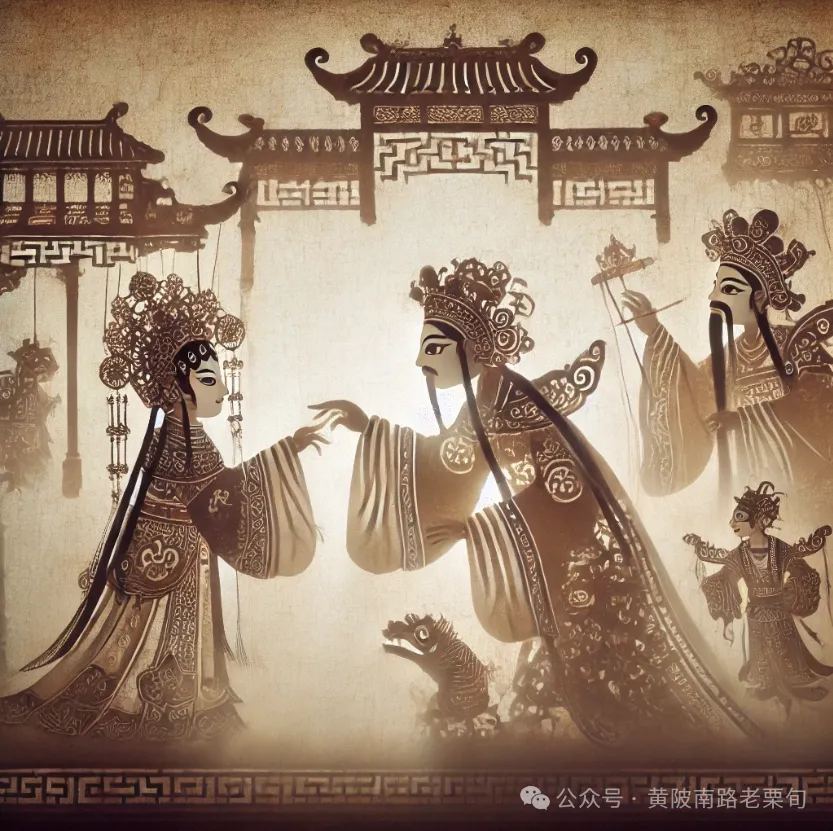

# 根本没有本质，表象就是一切

[`原创 黄陂南路老栗旬 黄陂南路老栗旬 2024年12月20日 10:13 广西`](https://mp.weixin.qq.com/s/UMKILCGXchz9nYwOQTlR4A)

*题图：皮影戏*

一个人的本质就是他的表现。完全没有必要去深挖所谓更加深层的、背后的、隐秘的本质。比如，他表面上跪下了 ，但其实他本质上是个英雄；或者，她表面上抽烟喝酒纹身滥交借钱不还，但是她本质上是个好女孩；他虽然表面上是刀子嘴，但是内在是豆腐心——这些说法都不足为信。有些事情不能跟着做，有些口号不能跟着喊，哪怕你心里一个字都不信。不管你心里怎么想，你跟着纳粹喊了口号，那你就是个纳粹。不管你自认为内心多么叛逆，只要跪下了，你就是个怂包，在这类场合，内心没有发言权，膝盖说了算，表象就是一切。

决定了一个人是什么谁的，只有他的行为，而决定了他行为的，则是其无意识幻想。他无法刻意地控制自己成为什么人，因为他无法决定自己的幻想，相反，所有人都被自己的幻想所支配。

【我一定要成为什么人】总是有某种幻想作为引导和背景。因此，意识和意图总已经是次要的衍生物，只有无意识幻想才能作为对一切人类个体分析的起点，包括自我分析。智慧如苏格拉底，也要把认识你自己作为终身课题，说明这种分析反省并不简单。

我认为【认识你自己】最方便的切入点就是对幻想的分析。比如，所有的成功学都基于一种【成为更好的、更成功的自己】的幻想，而何谓好何谓成功，则是事先被给定的。奈何人心隔肚皮，我们无法直观幻想本身，所以只能从现象和表现上来看，最简单最直接的就是看一个人对什么事物津津乐道，滔滔不绝，这是无法掩饰的无意识流露。【通俗说法：满脑子都装着什么东西】

这种热情有时候是否定性的，但它依然可以作为一种幻想的激情被感受到，比如聚会的一整个晚上都在说一个自认为讨厌的人的坏话，或者喋喋不休地讨论他有多么不喜欢某种东西，这种“津津乐道”里面就有爱和激情。《大话西游》有个对白，你爱上一个你讨厌的人，那段感情才是最要命的。

当你使用本文提到的反思方式，时刻注意到别人和自己在对什么事情津津乐道的时候，你就开始与这些幻想拉开距离，不再停留在起点了，不再像原来那样受支配，也就离苏格拉底所说的认识你自己更进了一步，离自由更进了一步。

