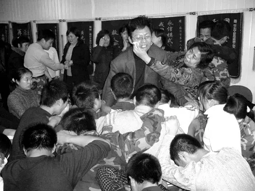

# 2023 年了，“网瘾”还是病吗？

*[三叔 倒场 2023-10-22 13:31 湖南](https://mp.weixin.qq.com/s/YKSXU0Kodl5FKhrNZyKChA)*

*前言：本文写于2020年9月，之所以在三年后的今天重发，是因为在我目所能及的地方，青少年群体在精神层面所遭遇的困难比三年前更为严重，而且暂时还看不到任何缓解的迹象；同时，在我耳所能及的地方，时常听到这样一种声音：比起父辈，孩子们越来越脆弱了：明明锦衣玉食吃穿不愁，却整天无精打采或要死要活——看来还得多吃苦。*

*我个人并不认为这种观点一定是错误的，但我们不能把它当成一种结论，而应当继续提出问题：孩子们变得脆弱究竟是什么导致的？谁需要为这种脆弱负责？——假设父辈们的精神的的确确比孩子们更为“强大”的话，那么到底什么是“强大”？一种“老子吃过的苦比你吃过的饭还多，照样精神抖擞艰苦奋斗”的优越感，还面对和承担责任的勇气？*

*在智能手机和5G网络无死角普及的今天，“上网”终于不再像如曾经那般被视为洪水猛兽。人们已经在日常生活中体验到，一旦进入网络空间，就不再有摆脱的可能——因为所有的社会关系都在其中。而直到今天我们才发现，那些一度声称要“禁网”、“禁电脑”的正义之士们，以及那些至今活跃在“戒网”一线的专家权威们，原来不是不需要网络，而只不过是还没来得及进入网络。但神奇的是，网瘾学校和网络成瘾门诊不仅没有消失，且仍然不依不饶的坚持对青少年展开“治疗”——哪怕比起青少年，成年人更加离不开网络和智能手机。*

*换言之，尽管所有人都已栖身于赛博空间，但“青少年过度上网”仍被视为一种需要被消灭的疾病。如果你也跟我一样对此感到荒诞，那么我们也许可以问一问：网络时代的今天到底如何定义“网瘾”？它是否仍可被算作一种疾病？我们是否还能以曾经的那种视角来看待它？*

*文中曾能止小儿夜哭，令无数青少年闻风丧胆的“雷电法王”杨永信虽逐渐淡出了人们的视野，但杨永信及其狂热信徒们却从来的没有远离过我们——他们就在我们中间，甚至就是我们自己，而这正是我分享这些文字的原因。*

----------------------------------------------

弗洛伊德说：症状不可治愈，只可能转移。拉康补充：人的存在本身就是一个症状。这意味着，任何一种单纯针对症状的手段都是在试图消灭一个“我”身上绝不可能被消灭的东西，或者毋宁说，消灭症状就等于在消灭“我”，这将导致比症状本身更为可怖的后果。

有个笑话直观的诠释了这一点：

*在耶稣基督被钉上十字架的前夜，信徒们考虑到耶稣还未感受过男女之欢，便决定安排一位叫玛利亚的妓女去侍奉他。结果不到几分钟，玛利亚尖叫着跑出了耶稣的帐篷，众人连忙上前询问。*

*只听见玛利亚抽泣着说道：“我向他张开双腿，不料他仔细端详了一会儿后把手覆在了上面……” *

*“然后呢？”众人焦急的问道。*

*“然后他悲悯的看着我说道：‘多么可怕的伤口！亲爱的玛利亚，让我用神力帮你愈合吧……’”*

*言毕，玛利亚泣不成声……*

然而，在弗洛伊德死去近一个世纪的今天，仍有不计其数的人，不论是被精神症状折磨着的病患和家属，还是被前者奉若神明的“专业人士”，依然孜孜不倦的寻找着一切可以消灭症状的方法。而作为中医的发源地，尽管我们对西医“头疼医头、脚疼医脚”进行嘲笑的回音犹在，但在精神卫生领域，许多人笃信的恰恰就是他们不久前还一度大肆嘲讽的那种逻辑。事实上，所有宣称可以“消除症状”的精神治疗手段无非是人体机械论在精神领域的回归。

近十年来，由五花八门的戒断/扭转机构组成的庞大产业链的兴起无非证明了，在面对精神症状时，人们依然崇拜并信仰着那种能立马治愈伤口的神力，但玛利亚们歇斯底里的哭喊却从来没有被真的听到过——只不过神力变成了知识，耶稣基督变成了专业权威。

曾获山东省第四届“发明创业奖”二等奖和临沂市卫生领军人才，被称为“全国戒网瘾专家”的临沂市第四人民医院副院长杨永信，就曾用电击、个人崇拜、洗脑、强制抓捕等一系列“治疗手段”，“拯救”了无数个被“网魔”毒害的孩子和他们濒临破碎的家庭，并在短短几年内入账八千万元。然而，在对杨一系列令人发指的治疗手段展开控诉之前，我们首先应当询问的是，为什么这种明显的施虐狂能堂而皇之的当上一家三级甲等精神专科医院的副院长，同时让无数家长奉为神明？——如果在一个社会中，一个施虐狂能身居高位受万人敬仰，那究竟是这个施虐狂有问题还是这个社会有问题？如果施虐者恶贯满盈，那么把前者当成神明来供奉，争先恐后把孩子交到他手上的父母是无辜的吗？

“雷电法王”杨永信接受戒网者跪地“忏悔”的场面

相较于跟孩子重新建立信任关系，通过良好的沟通和反思来寻找导致症状的真正原因，许多家长更愿意把希望寄托于神圣的权威——哪怕这位权威的言行让人生出反感和厌恶。这里可能有人要说，我不是专家，我没有能力去发现孩子问题的根源，更无法分辨治疗手段是否合理。这种言论听上去有道理，但其实是一种诡辩。

首先，有没有能力和想不想是两回事，如果父母真的关心孩子的感受，那么他们一定会先去跟孩子谈“为什么？”而不是去找专家问“怎么办？

其次，许多孩子的确不大愿意向父母表露心绪甚至撒谎成性，但这本身就是一个值得反思的问题：为什么一个人不肯相信ta的父母？这种信任曾经建立起来过吗？如果有，是怎么崩塌的？如果没有，为什么？

最后，我们的确不能奢望每一位父母能判断什么是更好更专业的治疗方法，但孩子在跟治疗者接触后呈现出来的精神状态不会骗人（更放松还是更紧张？更平静还是更焦虑？更勇敢还是更恐惧？），除非父母和治疗者在自欺欺人，或者他们的心智水平低到连孩子的情绪都无法分辨——这意味着首先需要接受治疗的就不是孩子而是父母。

把情感和精神世界完全科学化和专业化（把一切问题交给某位专家来解决），其本质是一种放弃——放弃感受和理解的尝试，仅仅考虑如何消灭症状。比如许多父母声称孩子“莫名其妙”的开始与世隔绝且沉溺于网络，并坚定的认为是网络游戏或者某种精神鸦片在祸害人（比如曾经的电视剧，武侠小说、漫画或者任何他们所不能理解的兴趣或爱好，殊不知这些已经是孩子最后的避难所），因此他们希望找到一“大师”甚至“魔法师”来“搞定”麻烦——在这种幻想的驱使下，去找一位权威来膜拜就丝毫不奇怪了。 *（而另一种极端情况是，不论一个孩子已经多么强烈的恳求父母带自己去见心理医生，但父母坚持认为孩子只不过是“想多了”或“压力太大，休息两天出去玩一趟就会好”，因为“我觉得”孩子没什么问题——哪怕后者已经在尝试自杀。这同样是一种放弃。）* 

不论是去感受自己的内心，还是去感受他人的内心，从来就是同一件事，也从来都不是一件容易的事：这个过程需要我们能够去面对自己最不愿意面对的东西。比如许多父母不理解为什么孩子不爱他们，甚至仇视他们，但他们没有意识到他们以同样的方式恨着自己的父母，同时以父母对待他们的方式对待他们的孩子。正因为从来没有得到过真正的爱，给出爱才会变得如此困难——不论爱的口号喊得如何响亮。孩子的每一个症状无非是他们对父母症状的一种反应，而在所有症状中，**“企图消灭症状”本身就是那个最麻烦的症状**。

也正是在这个症状的推动下，我们才能“有幸”目睹一个又一个魔幻的现实。比如在杨永信那里，电力不仅可以用来点亮文明的灯泡，还可以让一个又一个桀骜不驯的“网瘾少年”痛哭流涕的给父母下跪，毅然告别邪恶的网络世界……这简直是医学上的奇迹。当然，前提是我们得无视“治疗”带来的副作用，包括但不限于失语，抑郁，强迫思维和行为，周期性惊恐发作，失眠，梦游，大小便失禁等等，不论如何，某些人最深恶痛绝的那种症状消失了——取而代之的是一些更可怕的灾难。

不过，这类医学奇迹绝非我天朝首创，早在十八世纪中叶，苏格兰北部的一个农夫就因擅长“治疗疯病”而名扬一时。据说这位民间大师拥有大力神赫拉克勒斯一般的强健体魄——正如我们耳熟能详的那样，大师总是拥有某种“神力”，同时他们的治疗方案也非常简单且有效：像对待牲畜那样对待疯子们，强迫他们从事最艰难的农业劳动，只要稍有反抗，这位力大无穷的农夫就会拿起棍子展开治疗。在持续了一段时间之后，人们发现原本整天胡言乱语的疯子们都变得安静了，而且学会了守规矩和听话——只要农夫和他的棍子在场。负责任的讲，在科技相对落后的十八世纪，这根神奇的木棍简直可以跟杨法王的雷电之力相提并论。

如果精神治疗的目的仅仅是为了消灭症状的话，那么我坚信这位农夫在精神病学史上必然留有姓名——可惜我没有找到。不妨看看福柯对此的评价：“……**不是兽性被压抑了，而是人本身被消灭了**。在变成牲畜的人那里，非理性听从着理性的命令，于是疯癫被治愈了，因为它被异化于某种东西之中，这种东西就是它的真相。”而在精神分析的意义上，福柯的话完全可以改写为：不是症状被消除了，而是主体本身被消灭了。事实上，人类主体的存在本身就是一个症状：没有哪种动物会像人这样不知疲倦的制造并追寻欲望。

在弗洛伊德看来，症状就是欲望——绝不能说的欲望。通俗的讲，所有的欲望最终都联系着被爱，被尊重以及被承认，症状的出现无非意味着，病人正以一种迂回的、连他自己都意识不到的方式表达他想要这些——如果语言的表达无法得到回应的话。需要注意的是，爱不是宠溺，尊重不是顺从，承认也不是表扬或歌颂。许多人的确被宠溺着，顺从着，赞美着，却从未得到过爱、尊重和承认，倘若混为一谈，就很容易被：“难道我爱孩子有错吗？”这类问题绑架。

需要警惕的绝不仅仅是那些带着明确暴力性质的症状清除手段，那只不过是暴力诸多形式的一种，它完全可以隐藏在任何事物背后——比如一种被制造出来的道德压力（对父母的内疚），或是一种不容质疑的绝对性（你必须……才是好孩子）等等。杨永信首先是一个学术权威（先后在国家级、省级等专业学术刊物发表论文50余篇，在普通人眼里，这是真.权威），这就意味着哪怕他不采取任何针对身体的暴力手段，也已经凭借知识在对一些人实施精神上的支配和统治——这比直接在身体上施加的暴力更加恐怖。因为身体暴力可以用身体去反抗，但其他形式的暴力很可能让人连反抗都不知从何开始——因为它已经提前定义了谁是正确的，谁是错误的。

人的存在必须以欲望为前提，否则连起床和吃饭都会变成一种奢望。如果“抑郁症”不是指那些所有欲望都被自己强行抑制的人，还能是什么呢？也许“抑欲”这个词更合适一些——如果我想做的每一件事都不能做，那我为什么要起床呢？为什么要吃饭呢？难道活下去只是为了永远无休止的去做那些我讨厌的事情吗？反过来说，抑郁症患者仍在欲望——欲望着自己不要有任何欲望，这样就不会因为无法欲望而感到痛苦了。而“网瘾”同样涉及一种欲望，但这种欲望是现实生活中所有欲望都受阻后的无奈妥协：既然无法在现实生活中得到爱、尊重和承认，那就去网络世界里得到这些吧。

暴力是欲望的杀手，也是症状的来由。因为欲望是一种很神奇的东西——它只会被压抑而绝不消失，并时刻准备着以某种隐秘的方式完成表达。正因为这种表达偏执且不可理喻，才被误认为“症状”——正如拉康所言：“症状是一种隐喻，而这句话本身不是隐喻”。

欲望绝不是可以通过规定、培训以及学习得到的东西，而是一种被另一个欲望所激活的东西——只有动物的欲望才指向具体的事物，而人的欲望指向的是另一个欲望；因此，作为欲望之隐喻的症状也绝不是可以通过禁止、扭转和改造能够消灭的东西，而只能被另一个欲望重新拉回到欲望的维度（比如分析家坚持要听下去的欲望）。

许多人不理解为什么我每天告诫孩子应该这样不应该那样，孩子却我行我素，然后导致争吵甚至肢体冲突，搞得大家都很疲惫。原因很简单，因为孩子既没有动力去做那些你希望ta做的事，也没有动力不去做那些你自己都忍不住在做的事。

如果你希望你的孩子爱上阅读，你需要做的事情就绝不是每天一边看电视一边逼他去看书，而是自己认真的去读一本书然后去跟孩子分享你在阅读中体会到了什么；如果你希望你的孩子能安静下来认真听你说话，而不是你一开口他就爆炸，那么首先你自己就不能被情绪所吞噬，而是能坐下来好好听一听他到底怎么说（哪怕那些想法在你看来荒谬、可笑、不值一提甚至曾经让你暴跳如雷）。只有这样孩子才能体会到，你对ta的爱的确存在着，而不再是宣泄情绪或展开道德绑架的借口；

那么，回到网瘾也同理：如果你希望你的孩子能放下手机做点别的，你就不能一边死死拽着自己的手机一边呵斥ta必须放下ipad——规则是限制所有人的，只限制某个人或某些人的规则不能叫规则，只能叫压迫。这就是为什么父母一旦离开，孩子们就会想方设法的重新拿起任何能拿到的电子产品。未必是因为渴望，而是一种自我补偿和对于不公的反抗——凭什么你可以而我不可以？

的确，我们总是轻而易举就可以给孩子一万个不能放下手机的理由，我要工作，我在等一个重要的电话，我在查某个事情的进展，等等……但在孩子看来，这只不过是在找永远不要陪伴ta的借口——哪怕是国家领导人，也不可能一天二十四小时都在忙碌。也许我们可以跟孩子约定一个时间，一起放下手机，然后去做些ta希望我们陪ta做的事情：拍手游戏，阅读，画画，看电影，散步，什么都可以——哪怕ta一开始不怎么感兴趣，至少ta体会到自己在我们这里是重要的，是被认真对待的。否则不论设置多么严格的规则和可怕的惩罚，孩子都会被逼回网络世界里：如果在现实生活中根本找不到情感联接，那为什么还要待在这里呢？

当一个人成长到某个阶段，ta自然可以开始独自去做那些ta想做的事情，但这需要一个过程，一个在大部分时间里能得到父母的稳定陪伴和反馈的过程——直到某天ta可以从容的对父母说：我想自己试一试。问题是许多人根本就没有经历过这些，他们面对的是永远没空搭理自己，但情绪发作时让人恐惧的父母；或者过于严苛，从来不提供私人空间的父母。而网络空间有一个重要的属性就是，不论一个人说什么做什么，都能得到反馈和回应，同时ta仍保留着属于自己的空间，哪怕只是一个虚拟的空间权限。这当然会让人流连忘返。

因此，并不是网络勾走了孩子们的魂，而是日常现实中遭遇的冷漠和暴力把孩子逼到了网络世界里。比如一个十二岁的女孩，在她精心绘制的十几张准备送给同学的卡片被母亲烧掉后，陷入了尿床的窘境——她只能在床单上用尿液作画了。但这位母亲坚持认为女儿感染了某种泌尿类疾病，即便在医院的检查中没有发现任何问题，却仍强迫女儿服用相关药物长达半年。半年之后，女孩尿床的症状的确消失了，取而代之的是失禁——强烈的羞耻心让她拒绝在现实中建立任何社交，只能徘徊于网络世界寻找心灵上的慰藉。于是顺理成章的，她被定性为“网瘾病人”，被送进了网瘾学校，遭受新一轮的“治疗”和“矫正”，最终精神崩溃。在这个女孩身上，我们可以清楚的看到一个被暴力对待的欲望是如何转化为症状的，以及单纯消灭症状的企图是如何导致更为可怕的灾难的。

----------------------------------------------

