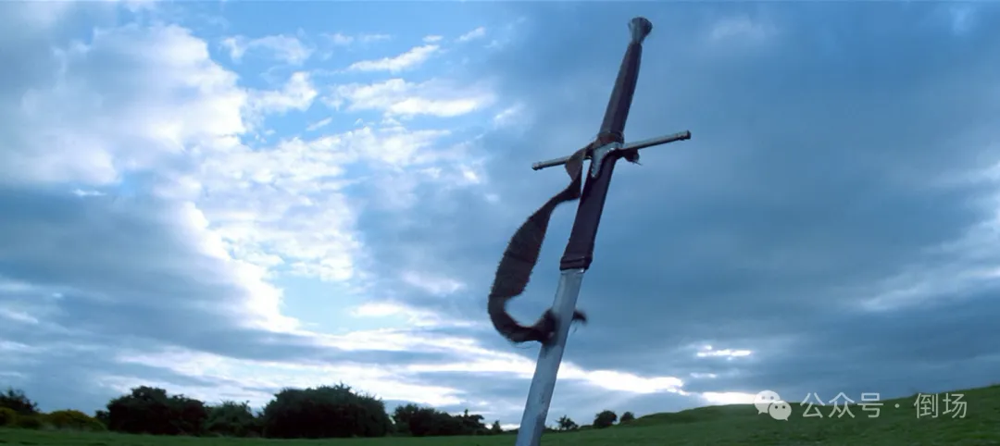
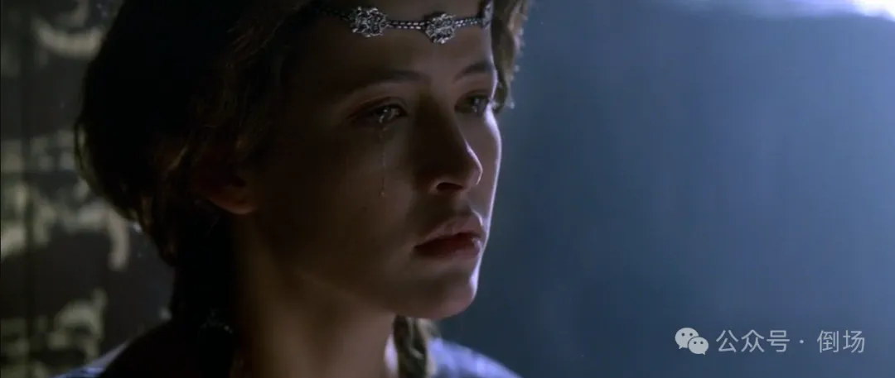
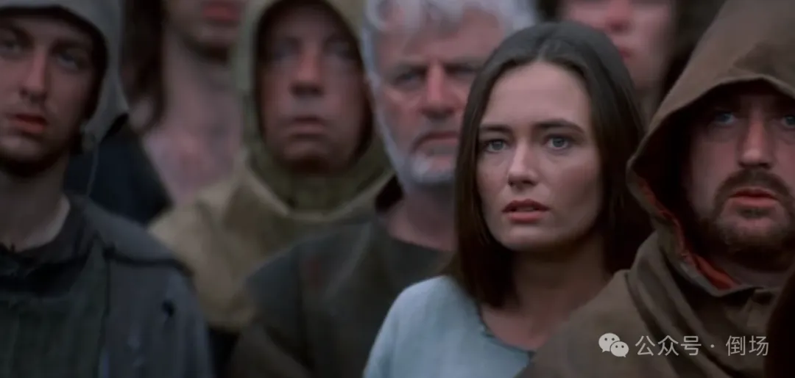
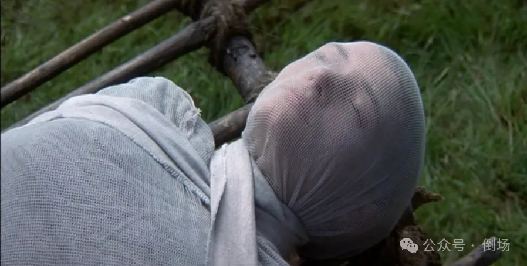
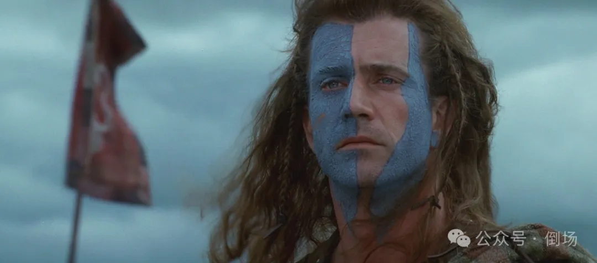
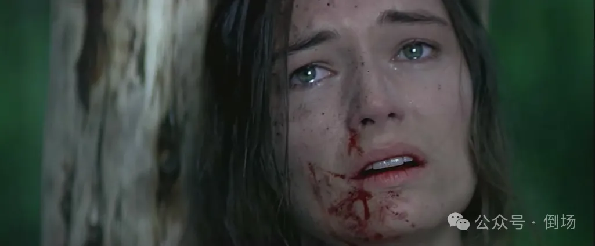
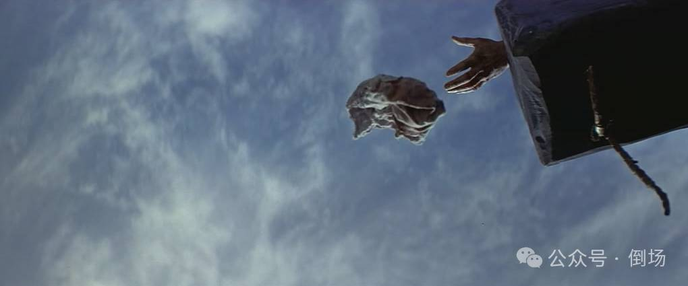

# 何谓“真正的行动”？——老电影之《勇敢的心》

*[原创 三叔 倒场 2024-01-30 16:42 湖南](https://mp.weixin.qq.com/s/AkuVd-tqRzjUJsTj8m4PIA)*

我很庆幸自己在十二岁时看到这部电影。十二岁，恰好是一个男孩儿刚开始憧憬爱情却又必须坚决否认的年纪，也是他迫切的需要找一个男人，最好是一个英雄来认同的年纪，还是他正准备带着恐惧和好奇去思考死亡的年纪。而这些就是电影的主题：一个英雄般的男人是如何为爱赴死的。

谈起它，首先在我脑中浮现的是河畔那场只有三个人参加的婚礼。男人骑马带着女人来到一颗巨大的古树前，把女人抱下马后，二人缓缓走向树下等候已久的牧师。新郎穿着平日里的衣裳，只是洗得格外干净；而新娘的白色嫁衣则是她劳作之余背着母亲偷偷缝制，头饰是不知名野花编成的环……

这颠覆了我对婚礼的看法：没有喧闹的人群和鞭炮，没有一堆看不懂的流程，也没有一大桌子鸡鸭鱼肉……只有一个男人和一个女人安静的对彼此说出誓言，简单，但神圣。这同时也颠覆了我对于婚姻的看法：婚姻不是一个男人和一个女人住在一个屋子里吃饭、睡觉和争吵，而是他们安静的看着对方，眼睛里映出对方的脸，而且显得很高兴。

然后是苏菲玛索那张惊心动魄的脸……我知道这个成语用在这里不合适，但请按照字面意思理解。这张脸的出现使我第一次意识到死亡并不一定令人恐惧——如果能在那样一张脸上长着的那样一双眼睛的注视下死去，死亡又有什么可怕呢？

这里再多的文字都苍白无力，还是直接上图吧。

最后是威廉华莱士以残破之躯在行刑台上高喊出“自由！！！！！！”的瞬间，打这么多惊叹号是为了表示他喊的时间非常的长。这是一个男人肉身成道的时刻，也是课本里那首《自由与爱情》道成肉身的时刻。

*生命诚可贵，爱情价更高。若为自由故，二者皆可抛。*

那一刻，这些句子不再只是印在书上的课文，而是流淌在那人身体里的炙热而滚烫的血。

不过需要注意的是，我们通过荧幕所认识并认同的“威廉华莱士”并非历史上那个真的华莱士，而是一个严格意义上的“现代”华莱士。决定角色属性的不是电影拍摄的年代，而是拍摄电影的年代。这里并不需要去追究两个华莱士是否做过同样的事，因为区分二者差异不是他们做过的事情，而是他们为什么那么做。

在我看来，电影最动人的地方，恰巧是它最“不真实”也最“现代”的地方：尽管一个传统主体完全有可能像故事里的华莱士一样去反抗去战斗，为了食物，为了生存，为了领地，为了族人，当然也包括女人（作为泄欲和生育工具的意义上）——但唯独不可能为了爱情。而对于华莱士而言，去战斗和停止战斗都是基于对妻子梅伦的爱，或者说，当他停止战斗时他才迎来真正的战斗：用血肉之躯承受一系列残忍的酷刑，然后在民众的唾弃声中悲惨的死去……而唯一能支持他完成这场战斗的是爱，就像耶稣那样。事实上，我们的确可以把二者等同起来：因爱而生，为爱而战，因爱而死。（看看人家是怎么拍主旋律片儿的。）

所以这是一部地道的爱情片而非战争片。真正使华莱士作为华莱士这个主体而存在的东西，不是率领族人走向自由的使命，而是他生命中最重要的两个女人的目光（即，华莱士的客体小a）。这一真相借一直追随华莱士的大胡子之口传递给观众：“你的梦想不是自由，而是梅伦……你以为她会在天上看着你。”

正是在妻子的白色嫁衣沦为裹尸布的时刻，华莱士举起了手中的剑。在那之前，爱人用双眼深情的看着他，只盼两人平静的老去；从此以后，爱人化身为目光这一客体，在天空中凝视着他，看他把利刃插入敌人的胸膛。事实上，华莱士的一生都在为那道目光而战，所有的行动都只不过是为了与后者再次相遇。正因为如此，他才偏执的等到行刑的最后时刻才回望向人群中的亡妻——尽管他清楚的知道那双眼睛未移开过他的身体，但他坚信自己必须战斗到最后才有资格去回应那道目光。这也是为什么拉康把客体a称为欲望的原因-对象，对华莱士而言，妻子的目光既是他行动的理由，也是他行动的最终目的。

英雄用来公开的承担其符号委任的表演姿态（尽管我并不想这么说）——即，华莱士在最后时刻高喊的那一声“自由！”，解释了他的符号身份与女人之存在的绝不相容，也呈现男性主体本身如何以女人之存在为前提。这就意味着，一旦男人试图背负起符号之委任，他就不可避免的在女人那里欠下了一笔关于爱的债务。前者是男人在象征秩序中登录的位置，而后者是男人作为人存在的地点——而这正是“主体”一词全部的意义：一个缺口，一道试图自我缝合但永远失败的伤疤，一次彻底的分裂。

任何一部以英雄为主题的电影都能说明这一点，比如当至尊宝捧起金箍，他的确成为了脚踏云彩，上天入地无所不能的齐天大圣，但紫霞在他心里留下的那滴眼泪无时无刻都在提醒着他，自己尚有债务未能偿清……在这个意义上，他是一个不折不扣的懦夫。

当布鲁斯韦恩穿上暗黑的战衣，他就化身为无所不能的蝙蝠侠。问题在于，蝙蝠侠的正义恰巧是普通男人最大的邪恶：他必须眼睁睁看着心爱之人葬身火海；

当华莱士在亡妻的葬礼上举起他的剑，他就承担起反抗英格兰殖民暴政，率领苏格兰人赢得独立自由的历史重任，但也彻底沦为永远孤独，被思念和仇恨的海洋所淹没的未亡人。

也正因为如此，华莱士不可能完成他的英雄伟业/符号使命——尽管我们并不能说，死在行刑台上的那个男人不算英雄，但那是一个女人的英雄，而非这场战争的英雄。导致悲剧性结局的那个莫名其妙的选择，并非出于政治上的考虑，而是因为亡妻的温柔目光已在他身上划好命运的伏线：尽管他的嫡系部队士气昂扬，尽管他的威名广为传播，尽管他的任何行动都能得到敌方王妃的暗中支持……但华莱士就是选择了拿自己的命去赌一群豺狼的道德底线，那么结局自然可想而知。

但麻烦的事情就在这儿：倘若华莱士真的只考虑他的使命——把杀妻之恨全然抛在脑后，凭借理智和逻辑展开行动……那么这个荧幕形象就会轰然倒塌，甚至整个故事都无法开始——一个“理智的”、“成熟的”的华莱士根本就不可能为了一个女人去跟一群全副武装的士兵动手，更没有什么东西能去打动一个帝国的王妃（正是因为听到华莱士与妻子的悲惨遭遇，王妃才对这个痛苦而温柔的男人产生强烈的好奇，才在不知不觉中堕入爱河……）。

而即便这样的华莱士最终成就了伟业，男人们只会敬畏他而无法认同他，因为他们在他的身上找不到到属于自己的那份软弱；而女人则更不可能爱上他，因为那种“理智”和“成熟”只会让她们感到恶心。真正的男人从来都不是能永远“不偏不倚”朝着使命/目标前进的精密机器，真正的男人是一个明明痛失所爱且满身伤痛，却因为某种使命而坚强得让人心疼的家伙……

这难道不是拉康那句臭名昭著的“女人是男人的一个症状”的全部意义？——一方面，女人是男人承担其符号身份的最大阻碍；但另一方面，正是因为这种阻碍的存在，使得男人成为了男人，一个可以被男人认同，被女人爱上的男人。这个男人的存在依赖于女人这个症状，因此他真正的外在于他自身，他的存在的前提位于他自身的外部，在一个女人那里（比如紫霞的眼泪和梅伦的目光）；

与之相对的是“女人并不存在”。她完全内在于她自身，她既是她自己的容器也是她自己的本质，她存在的一致性在任何别的什么地方都找不到依据，所以她总是并非自己的全部，而是她超出她自己的那个部分——她就是死亡驱力的化身：一种“哪怕是死，那怕已经死了，我也要……”的根本伦理态度。就像华莱士的妻子：“哪怕是死，哪怕我已经死去，我也要一直看着我的爱人，哪怕这件事毫无意义……”

很明显，华莱士孤身赴约的行为中所包含的自杀维度是不言而喻的。而当拉康以一种挑衅的语气说，唯一的**真正的**行动是自杀时——把自己的一切，包括生命置于一种险境，却放弃任何现成的意义，他肯定了行动本身的女性本质。换言之，当华莱士决定“毫无意义”的赴死，决定去跟那道“毫无意义”的目光相遇，他正经历着一场“真正的”行动，并通过这场行动“成为女人”——原谅我牵强的把行刑台上可能发生过的实实在在的阉割与此观点联系起来。

与此相比，那些无时无刻寻求着象征秩序/符号父亲之庇护的人，是何其懦弱和无趣！他们总是骄傲的强调自己的种种行为已经得到某个爹或权威的认证和担保，然后用扭过头去质问真正的行动者：“你的行为经过了谁的同意？”，“你做的这一切有什么意义？”……但事实上，他们越是强调自己行动的合理性和合法性，这种行动就越是显得虚伪和可笑——妄想着凭借爹的力量防御必然到来的死亡和阉割。因此，这样的行动不论看上去多么主动，多么有意义，其实都只不过是对父亲的讨好和取悦，都只不过是对死亡驱力以及行动之自杀本质的回避，其唯一的意义就是阻止任何真正的行动的到来。

----------------------------------------------

三叔，精神分析家，国家二级心理咨询师，木匠。
