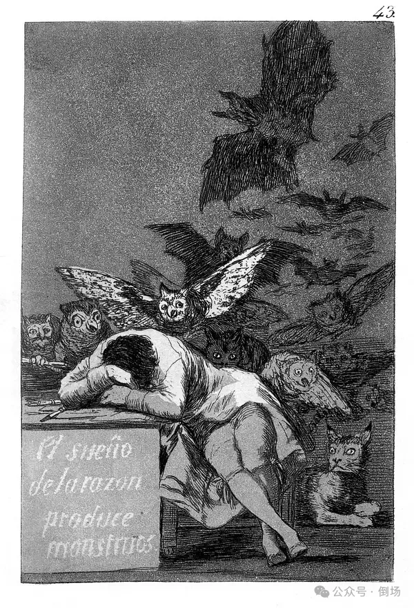

# 为什么正常是一种极致的疯癫？

*[原创 三叔 倒场 2024-03-08 09:30 湖南](https://mp.weixin.qq.com/s/im90EFlq7l92OOv18ktYdA)*

> 即使被束缚在果壳之中，也可以自以为是无限空间之王。——莎士比亚

> 我思考的东西，我思想的产物，是客观真实的。——黑格尔

> 这当然是真的，即便它从未发生过。——《飞越疯人院》

我们对于一个人“正常”或“不正常”的判断，从来都没有离开过一个这样的标准，那就是这个人能否”正常”的使用语言。通俗些说，就是这个人能否听懂其他人说的话，以及其他人能否听懂他说的话。而且，这个标准几乎脱离于时代、地域、种族、信仰以及认知水平的限制——我们不假思索的相信，只要是人，就一定能听懂并使用至少一种语言。否则这个人——用一种政治正确的说法，叫“跟我们不一样”，总之比弱智、哑巴或者二傻子要友善太多。

不过，也有一些智者（至少我遇到过，而且不止一个）坚持否认这种“天经地义”——在这一点上，他们是**对**的。但同时他们又急不可耐的宣称，人应当摆脱语言的束缚，从而回归“真正”的自己，抵达“真实”的世界……在如此超凡的理念面前，平凡如我实在深感平凡。不过仍令我困惑的是，倘若离开了语言，智者们要如何辨别真假——我们不能想当然的认为，看得见摸得着的就为真，反之为假。梦就是典型的例子。尽管拉康声称梦更加真实，但这并非因为梦里的东西看得见摸得着，而在于梦能够说出被拒绝的真相。

我们无需费尽心思去设想离开了语言，人究竟是何种状态，因为在一些特殊的人群身上已呈现得非常清晰。比如狼孩，发病阶段的精神病人，以及重度孤独症患者……如果能接触到的话，就会知道那到底意味着什么——前提是愿意忍受某些幻想的破灭。在这些幻想中，狼孩儿被视为人猿泰山或者森林好小子卡利奇，凭借“本真的天性”在林间自由奔跑，与自然界里各类动植物和谐共处；发病的精神病人就像电影中的琼一样敏感而美好，而她全部的痛苦都因为尚未遇见天真、英俊且能读懂她内心的萨姆；孤独症则是流落人间的精灵族公主，携带着某种尚未被人发掘的惊人天赋平静的生活在都市边缘，每天只是安静的望向窗外，对这个光怪陆离的世界既没有怨恨也没有向往……

然而，我们其实并不需要考虑在遇见泰山、卡利奇、乔、雨人以及精灵公主时应该选择什么样的语气和礼仪，因为他们压根儿就不会出现。真正需要准备的是一些情况发生时应当作何应对——它们包括但不限于：无休止的奔跑、摇晃、嚎叫和敲打，随时可能发生的身体暴露、失禁、毫无征兆的崩溃和自我攻击，还有在一转头的功夫，把地面或垃圾桶里色彩斑斓但看上去明显不太像食物的东西塞进嘴里……

我不清楚这些是否就是摆脱语言束缚后找到的“真实”，如果这就是人的真相和目的，那我个人宁可继续保持虚伪。但重点并不在此，值得注意的是对于特殊群体过于浪漫的幻想——即使这些幻想曾有过“实际参照”，也仍是不折不扣的幻想。因为它们所陈述的形象都遵循同样的逻辑：一个尚未被俗世玷污的无辜者，肮脏的世人根本无法理解和接纳它的纯洁……如果这不是黑格尔所说的美丽灵魂，又是什么呢？

对特殊群体的过度美化和对美丽灵魂的深沉迷恋，反应出一种集体的自恋式认同——尽管把美丽灵魂的形象投射在特殊群体身上，但我们真正想说的仍是关于自己的处境和故事。如此一来，智者们对于语言的排斥也就完全能够理解了：尽管在意识-自我认知层面，每个人都善良、孤独、纯洁并与肮脏的世俗世界保持着一种清醒的距离，可一旦进入具体的社交情境和更进一步的亲密关系，我们就会开始不自觉的变得恶毒、嫉妒、谄媚且乐于操控和引诱——这个肮脏的部分明显不符合自我认知，因此我们自然就需要一个能撇清责任的解释：俗世的污秽以语言为中介，玷污了我的纯洁，是导致我内心冲突和痛苦的罪魁祸首。

事实上，每个人都使用过这种狡猾的伎俩：编织一个冠冕堂皇的立场/理念/故事来证明自己的屁股上从来没有沾过屎，即使沾过，那也都是别人给蹭的。但不论这个故事包装得怎么精美，终究无法掩盖这样一个事实：每一场悲剧的发生都离不开主体的亲自参与。需要说明的是，这绝不是简单的受害者有罪论——受害者的确无罪，但仍需要承担起一种伦理责任，比如对遭受的伤害做出正面的回应。真正的自我保护从来都不是躲在沙堆里当鸵鸟，而是以自己的方式对伤害行为展开反击、陈述和诠释。正如瓦格纳在《帕西法尔》里告诉我们的那样：唯有伤你的矛，方可治你的伤。

而现如今，这种狡猾的精神胜利法之所以屡试不爽，甚至随时都能占领舆情高地，绝不是因为它有理有据到无懈可击，而仅仅在于它很容易受到社交礼仪以及政治正确的保护，尤其在这个据说要尊重每一种特殊性的时代——尽管在许多时候，某些所谓的“特殊性”无非是一些已经捂得发臭的屎，但每个人都皱着眉头声称我们尊重这种特别的味道。

人创造了机器，机器反过来对人展开支配和奴役。拉康从马克思那里继承了“异化”的概念，以阐明人与语言之间的关系。人栖居于语言之中，使用语言的同时被语言所支配和操纵，这是不争的事实。但正如我们在狼孩和孤独症患者身上看到的那样，人类婴儿并不必然进入语言，也不必然接受语言的统治。不过很明显，能说话的人比不能说话的人看上去要“正常”得多……至少就我个人而言，我更愿意跟能说话的人交朋友，因为不必担心对方把尿撒在我裤子上，来标记我身体的归属权……哦不，天知道人家怎么想。但是，我们真的能说前者“正常”而后者“疯癫”吗？

但凡仔细考量，就会发现这并不是一个容易回答的问题。比如我，我一般自称是“三叔”，是一个“精神分析家”；然后，假设此刻我对面蹲着一个狼孩，他好奇而警惕的看着我，并在我站起来或说话的时候开始龇牙……在世俗意义上，我的的确确看上去很“正常”，而他看上去很“疯狂”。可问题是，“三叔”和“分析家”都只是一些音节，它们都不是真正的“我”，那么我凭什么认为，我可以仅凭声带所发出的一些音节就能让对方明白我到底是个什么东西呢？我又凭什么让对方相信，我的一举一动都不会对他造成伤害，因此不需要对我保持警惕呢？

如此说来，还有什么比“使用语言”这件事更加疯狂的呢？——将一些原本毫无意义的音节进行各种排列组合，以此来指代和解释整个世界，甚至坚定的认为不这么干的人发了疯……跟这种疯狂比起来，狼孩那些“奇怪”的举动又算得了什么？面对陌生的环境时对出现在面前的生物感到好奇和警惕——就像我们误入外星人领地那样，难道不是再“正常”不过的事吗？在狼孩儿眼里，我们难道不是一些畸形怪状，且用口器发出诡异声响的怪物吗？难道不应该像我们在面对被病毒感染的丧尸时一样感到不安吗？

所谓“正常”，只不过是人类被语言感染后所引发的症状，我们正是以这种症状来辨别同类和异类的。换言之，看上去最为疯癫的狼孩和孤独症恰恰是最正常的，因为他们完全没有被语言这种病毒所感染；而精神病尽管遭遇了感染，却“清醒”的把语言视为一种外来的病毒——在这一点上，他们完全正确。所以他们的问题不在于疯了，而在于没有完全疯；至于“正常人”，即神经症，则是完完全全将病毒当成了自己与生俱来的部分，因此属于最疯的那一类……在这三种情况里，精神病主体遭受着更多的痛苦/享乐，因为语言在他们身上完成了入侵，却无法跟精神”融合”，因此格外容易出bug导致系统短路。而为了避免这种情况发生，精神病主体不得不做出各种奇怪的尝试——正如弗洛伊德在施瑞伯身上看到的那样，后者的谵妄以及相关症状是一种因为失去现实感而不得不展开的对于精神世界的补偿和再生产，主体在妄想中重新创造了自己的形象和神话，以阻止其自身和现实的解体，其实是一种自我疗愈的努力……

现实并不是真实。作为人类主体，我们从来都没有生活在一个客观、恒定、真实的世界之中——否则这样一个现实就不可能崩塌；现实并不位于想象的彼岸，而是想象的一种样式，一个亚种，是一种被象征所规定的想象。比如钱这个全世界最“现实”的东西，如果不是每一个人都将其“想象”为某种价值的凭证，它就不可能用来交换任何东西。同理，理智与疯癫的差异也不是外在的，而是内在的，理智也只不过是疯癫的一个亚型，一种被某种原则所规范的疯癫——而这种原则，或者说象征秩序的在场，正是压抑的基础。这就是为什么拉康把父之名形容为一个函数，一种运算法则，它规定了整个系统如何处理数据，并阻止那些可能导致系统崩溃的数据出现在前台，而尽可能留存在后台运行。这就是压抑一词的全部意义。

而精神病人的痛苦并不在于无法思考，而在于无法停止思考（就像一句谚语说的那样：疯子失去了一切，除了理智）。导致这一情况的原因当然是压抑机制的缺失，或者更准确的说，是因为压抑的基础——即对思考做出规定的那种秩序，从一开始就被排除了。正如前面提到的那样，这种秩序会禁止一些数据轻易来到前台，比如“妈妈有没有想过抛弃我？”，“爷爷会不会强奸我？”，“我的身体还在吗？”，“墙上的洞会不会把我吸走？”……事实上，这些问题的确值得认真对待，因为它们真的有可能发生。

而神经症之所以不会时时刻刻被这些问题困扰（并非它们一定不会发生，而是说“暂时”没有担心的必要），是因为秩序及其代理人（一般而言，是家庭中那个努力确保每个人都不受伤害的照顾者）对一些可怕的事情做出了禁止，并为此进行担保。而一旦这种秩序没有建立起来，那么主体就不得不时刻警惕那些确实可能发生的灾难，以至于陷入无穷无尽的焦虑和怀疑之中（当然，我们都很清楚精神病人有一个特征是偏执，或者说笃定，这跟他们的怀疑并不矛盾——如果一个人总是怀疑某件事会发生，那就意味着其实他笃定此事一定会发生）。

换言之，精神病人的理智是完全“正常”的，但他们时常被迫要去面对那些理智根本无法处理的事件：邻居那样盯着我，会不会伤害我？跟同事的接触让我浑身燥热，是我被她下了毒？我无法集中精力阅读，总是想起同桌，是不是他在远程控制我的思想？……随之而来的是更多“诡异”的经历：门后的黑影，隔壁传来的谩骂声，同路的红衣女子，报纸上的离奇事件，连夜的怪梦……一切的一切都迫使精神病主体必须时刻保持高度紧张，直至不堪重负而完全崩溃。

如果这不是拉康“被象征界排除，而只能从真实界返回”的物，还能是什么呢？需要强调的是，这些“真实”之物并非来自于外部——尽管外部世界的确威胁着每一个人，但并非每个人都会因为这种威胁而不敢出门。因此，疯癫并不是因为主体从外部世界遭遇了它所无法消化的东西，而是主体因为不够疯癫而不得不排除它原本就没有消化的东西。而为了活下去，为了得到走出房门去爱去战斗的勇气，主体真正要做的就不应该是排除，而是生产——哪怕是以一种看上去疯癫的方式去生产。比如谵妄，无非是主体正在为一些奇怪的、可能会伤害他的事情所做出的解释，这个过程将建构起一个更顽强的消化系统或荷载更大的电路——比如当施瑞伯感到自己的身体正在“变成女人”时，他对此做出的解释是自己是上帝的女人，并承担着孕育新人类的使命。不论这个说法听上去多么疯狂，它都为“变成女人”这件事赋予了一个暂时的意义，稳固了主体正动荡不安的精神世界，而不至于导致更大的灾难。

但仅仅凭借妄想并不足以让精神病主体摆脱发病和崩溃的风险，因为一旦遭遇新的刺激——这随时有可能发生，而且并不需要来自外部，原有的妄想很可能不再起作用。因此，不论是作为家人、朋友还是分析家，我们还需要鼓励主体把这些妄想变成些更加“实际“的东西，更加难以被否定和击垮的东西，比如一首诗，一个故事，一副画，一部小说，一段旋律，一首歌，一部电影甚至一个游戏……这确保了任何刺激最终都能成为故事里的情节、旋律中的音符或画面中的色彩，而不必直接作用于主体的身体或精神——如果这些行动不是艺术的另一个名字，还能是什么呢？这也是为什么德勒兹坚信只有艺术能抵抗死亡——他回应了福柯的那句”疯癫是已经到场的死亡”。“治愈”一词的全部意义就在于此，真正的治愈是对疯癫的增补，而非清除。

------------------------------

