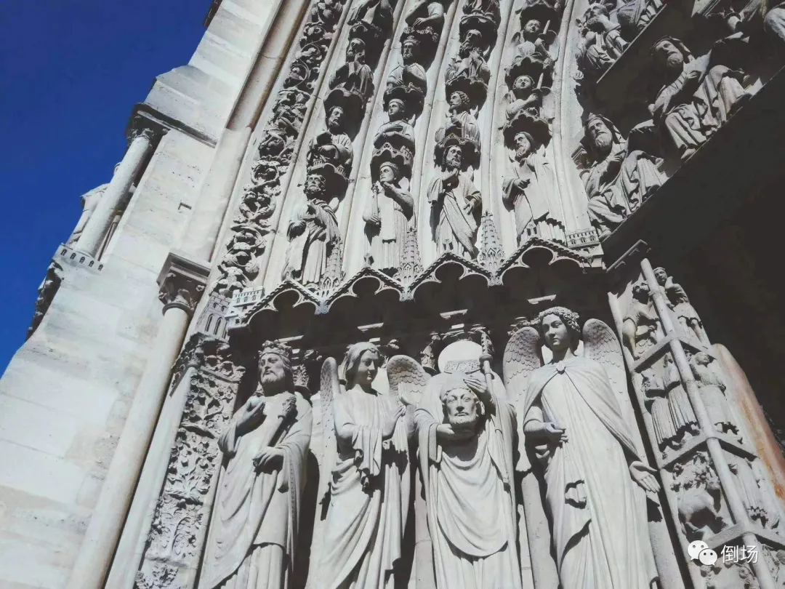

# 为什么是拉康？

[*三叔 倒场 2023-12-28 14:13 湖南*](https://mp.weixin.qq.com/s/9Tlkyvo5catDKBaefGBUvg)

圣诞节在霞峰家里聚餐，张新当然也是在的。一桌好菜，其乐融融。然而，就在我完全放松警惕，打算把接下来的流程赶紧走完然后回家冲钻石……好吧其实是翡翠的当口儿，张新冷不丁来了一句：“跟你约的那篇稿子写得怎么样了？这都快三个月了……”

好问题，这个问题好就好在它来得很突然，突然到让人根本来不及准备。于是，趁着放筷子的功夫，我悄咪咪的搜索了一下硬盘，嗯，根目录里压根儿就没这个文件，子目录里也没有，嗯，不出所料，幸好是固态硬盘，不然还得卡一会儿。既然筷子放下了，那就再喝口战术茶，容我的八核多线程急速处理器好好算一下该怎么答复。首先，朝垂死病中惊坐起那个方向演是一定不行的，那意味着我完全没把跟他约好的事儿放在心上；但也坚决不能表现出我真的把这个事儿放在了心上，否则长达三个月的时间都没搞定会显得我很弱。于是，在系统经历一个极为短暂的小卡顿过后，我非常从容的现编了一个这才刚过两天就已经忘得一干二净，但应该还过得去的理由。

那么，既然理由可以现编，文章为什么就不可以呢？毕竟在编瞎话这个领域，我早在多年以前就已经摸到了自在自如之境界的门槛，尤其聊起精神分析和拉康时更是驾轻就熟，唯一需要注意的只不过是在起范儿时别忘了摆出一副“我跟拉老爷子的交情日久年深，江湖上谁个不知哪个不晓”的睥睨气质，就根本不用担心瞎话被人戳穿——因为精神分析圈（如果真有这个奇妙的圈子的话）真正读懂甚至读过拉康的人我至今也没遇到过几个。

当然，不可否认的确有许多老师大师甚至大宗师，脑袋上都顶着“拉康派”的头衔，号称研习拉康多年，但我感觉，注意，只是我感觉，他们应该的的确确是认真研习过跟拉康有关的各种书名，诸如《别拉，康复中心的厕所堵了》，或者《孩子老拉炕上不要慌，一招教你轻松解决》等名著，否则不可能表现得跟我一样厚颜无耻……啊呸，了然于胸。啊，没错儿，拉炕属于谐音梗，但我们分析家不care这个。或许，也许，大概，某些极个别的师傅会高抬贵手多翻一页，看一眼目录，但我毫不怀疑他们此时依然保持着某种优雅的克制——因为再看一眼就可能要判刑，而且众所周知，高手都讲究一个点到为止。当然，这在我看来还是过于谨慎了，其实不看目录已经可以应付绝大多数情况，完全没有必要为一些极低概率才会发生的尴尬场面而浪费师傅们宝贵的时间。

而另一种情况是，某些智者带着批判的精神“读完”了拉康，因此他们提出的问题完全可以用振聋发聩来形容：“拉康说的就一定对吗？荣格/福柯/萨特/德勒兹明明说过……”，“拉康/弗洛伊德所代表的难道不只是那个时代一小部分人的观点吗？现在时代已经完全不一样了，我认为不是这样，而且XX老师也说……”（我觉得您完全可以更大胆一点儿，他们连一小部分人都代表不了，他们只能代表他们自己，根本不能跟您以及您的XX老师这样可以代表大多数人的时代之子相提并论。）

对于这样的问题，以及发出这种询问的智者，一开始我是满怀尊敬和钦佩的——他们居然已经凭借自己独立的思考摆脱了权威的桎梏，跟我们这些愚昧的信徒拉开了一段如此遥远而清醒的距离……这着实令我这种依然打着拉康的旗号坑蒙拐骗的神棍感到汗颜。然而，在认真听完他们所描述的荣格/福柯/萨特/德勒兹以及他们自己的观点之后（这个过程一般两个钟头起步。另，也别问我为什么这么闲，毕竟哥就是靠听人说话糊口的，而这种情况一般收双倍，虽然不一定要得到——毕竟比起接待来访，跟如此自由的灵魂的相遇会格外废烟一些，所以也格外伤肺一些，所以这钱我挣得你眼红不了一点儿……），我的尊敬和钦佩已经无可奈何的升华为敬仰和崇拜：他们居然专门花时间记住了这么多外国佬，而且是死了很多年的外国佬的名字，真太温，我哭死。

拉康当然也只不过是一个死了很多年的法国佬的名字，很多时候我甚至连他的全名都想不起来：牙科……麻利儿的……爱什么拉康？踏马的什么样的傻子会取这么难记的名儿？字母加起来比身份证号码都长。所以在我个人看来，注意，还是我个人啊，“为什么是拉康？”这个问题跟“为什么是王二麻子中了彩票？”、“为什么是龙傲天当主角？”、“为什么是阿珍爱上了阿强？”一样毫无逻辑——因为命运不讲逻辑，而无意识也是如此。对于你我来说，拉康跟王二麻子、龙傲天和阿珍没有区别，他们压根儿就不在我们的硬盘根目录里，跟我们的生活没有一毛钱关系——除非你家孩子也拉炕，除非王二麻子中了彩票要跟你离婚，除非龙傲天把你视为青云路上的绊脚石，除非你就是那个莫名其妙被爱上的阿强。

拉康想说的是，或者应该说，我三叔，啊不是，不是我三叔，是我这个叫三叔的人，想借拉康的名义说的是，即便没有拉康，我们的生命里必然会出现一个这样的人：他洞察一切，他完美无瑕，他无所不能，他身上携带着一件我们无比渴望却求而不得的宝物。总之，不论是近在咫尺还是远在天涯，他都能轻描淡写的说出关于“我”的真理——好像从我们出生开始，他就一直趴在房檐上或者窗户外面偷看似的。但世间真有这样的一个存在吗？没有，不论是过去、现在和将来都没有，也不会有——唯一的问题是我们拒绝接受。

是嘛，既然这个人根本就不存在，那么他为什么还会出现在我们的生命里？为什么在他出现的时刻，会让我们坚信自己被命运击中，或者觉得他本身就是我们命运的代理？——并不是说阳具以实在的方式补足了象征秩序的缺陷，而是主体借助阳具以想象的方式回溯性预设了完整象征秩序的存在。翻译成人话就是，他之会所以出现且如此特别，并非因为他真的存在或他真的如何特别，而是因为我们需要这样一个他来填补意义的缺失——如果没有，我们就把他创造出来，或者在我们的视线中想方设法把他指认出来。正因为我们在面对生活时感到无力和痛苦，我们才如此需要一个足够完美的存在来告诉我们活下去的意义和理由——为此我们必须时刻保持茫然，时刻保持一种懵懂无知的状态，以确保拯救者的出现。为了体验被拯救的美妙，我们不惜让自己一次又一次陷入深渊。

正如鲁迅先生说的那样：这世上本没有派，想吃派的人多了，才有拉康派，王二麻子派，龙傲天派以及阿珍派。然而真正有趣的事情是，拉康派任何人都吃得，却唯独拉康他自己吃不得，所以拉康才点名要吃弗洛伊德派。

《搏击俱乐部》里，布拉特彼得有一段令人绝望同时又热血沸腾的演讲：*“广告诱惑我们追逐汽车和衣服，这样我们就会拼命工作，然后去买那些自己根本不需要的东西。我们没有世界大战可以经历，也没有经济大萧条需要恐慌。我们的战争是内心之战：我们最大的恐慌就是自己的生活。”*

这当然就是现代人生存的真相——我们亲手杀死了诸神和上帝，但谁能说我们真的不需要他呢？没有了战争，我们连去战斗的理由都找不到，连去战斗的对手都找不到，我们只能跟自己作战，以杀死自己和自己的生活为代价，去追逐广告和电视剧里那些奇奇怪怪的东西，却没有人站出来负责调停。为什么是拉康？哦，我的朋友，你得抓住重点——为什么不能是拉康呢？重要的不是拉康或王二麻子，而是踏马的“**我**”的拉康！是**我**借拉康的名义来阻止**我**杀死**我**自己！

哦，我真的爱死《搏击俱乐部》了，因为主角跟拉康一样，明明亲手建立起一个可以供任何人完成自我救赎的王国，但作为国王的自己却偏偏不能被救赎而只能被流放——但我们最终会发现，这种流放本身才是真正的救赎。

**“你要假设上帝不爱你，他一直都不想要你，或许还很讨厌你。你的痛不是最悲惨的事。我们不需要他，去踏马的诅咒和赎罪，我们都是被上帝遗弃的子民。”**

\----------------------------------------------

三叔，精神分析家，国家二级咨询师，木匠。
